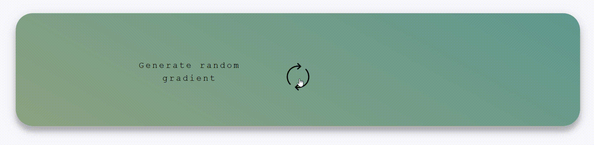
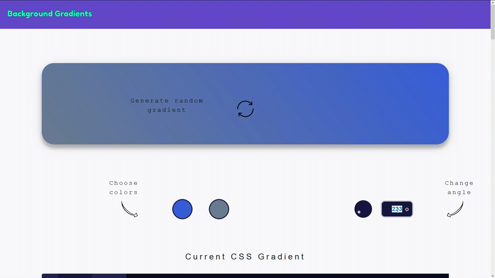
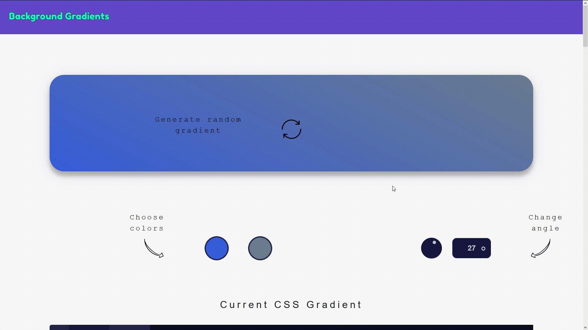

# backgroundgradients.com

*A simple website that generates the copy-pastable code of the gradient of your choice in RGB and CSS format.*

## Installation

Just head over to [https://backgroundgradients.com/](https://backgroundgradients.com/) to get started.

## Usage

Generate a random two-color gradient by clicking the 🔁 symbol.

  

For more tuning, you can choose colors with the color picker:

  

Change the gradient angle via the wheel or the text box:

  

Export your gradients in either CSS or plain RGB:

  

## Contributing
Pull requests are welcome. For major changes, please open an issue first to discuss what you would like to change.

Please make sure to update tests as appropriate.

## License
[MIT](https://choosealicense.com/licenses/mit/)